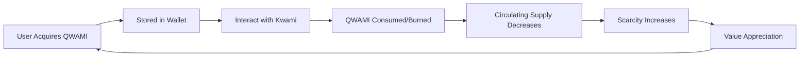

# QWAMI Token Economics

## Overview

QWAMI is the utility token that powers the Quami AI ecosystem on Solana. It serves as the energy source for AI services and interactions with your Kwami companions.

## Token Specifications

| Property | Value |
|----------|-------|
| **Token Standard** | SPL Token (Solana Program Library) |
| **Symbol** | QWAMI |
| **Decimals** | 9 |
| **Max Supply** | 1,000,000,000,000 (1 trillion) |
| **Base Price** | $0.01 USD |
| **Blockchain** | Solana |
| **Program Type** | Anchor (Rust) |

## Token Utility

### Primary Uses

QWAMI tokens are consumed when using AI features:

#### 1. AI Interactions
- **Chat Messages**: 1-10 QWAMI per message (based on complexity)
- **Voice Responses**: 5-20 QWAMI per response
- **Reasoning Tasks**: 10-100 QWAMI per task
- **Code Generation**: 20-200 QWAMI per request

#### 2. Voice Synthesis
- **Text-to-Speech**: 5 QWAMI per 100 words
- **Voice Cloning**: 500 QWAMI per voice model
- **Emotional Modulation**: +2 QWAMI per utterance

#### 3. Advanced Features
- **Long-term Memory**: 10 QWAMI per day
- **Personality Training**: 100-1000 QWAMI per session
- **Multi-Kwami Conversations**: 5 QWAMI per Kwami per interaction

#### 4. Marketplace & Trading
- **NFT Listing Fees**: 100 QWAMI
- **Trait Upgrades**: 50-500 QWAMI
- **Collaboration Features**: Variable pricing

## Token Economics

### Supply Management

#### Minting
- **Authority Required**: Yes (controlled by program authority)
- **Cap**: Cannot exceed 1 trillion total supply
- **Rate**: Dynamic based on demand
- **Distribution**: Via exchanges, airdrops, rewards

#### Burning
- **Mechanism**: Automatic when AI services are consumed
- **Rate**: Varies by feature usage
- **Effect**: Reduces circulating supply
- **Tracking**: Total minted and burned tracked on-chain

### Tokenomics Model

```
Total Supply: 1,000,000,000,000 QWAMI
├── Initial Distribution: 300,000,000,000 (30%)
│   ├── Public Sale: 150,000,000,000 (15%)
│   ├── Liquidity Pool: 100,000,000,000 (10%)
│   └── Airdrop: 50,000,000,000 (5%)
├── Team & Advisors: 150,000,000,000 (15%) [4-year vesting]
├── Development Fund: 200,000,000,000 (20%)
├── Ecosystem Rewards: 200,000,000,000 (20%)
└── Reserve: 150,000,000,000 (15%)
```

### Pricing Mechanics

**Base Price**: $0.01 USD per QWAMI

**Dynamic Pricing**:
- Price adjusts based on usage demand
- Burn rate influences scarcity
- Market forces on DEX/CEX
- Governance can update base price

**Cost Examples**:
- 100 QWAMI = $1.00 USD (at base price)
- 10,000 QWAMI = $100 USD
- 1,000,000 QWAMI = $10,000 USD

## Acquiring QWAMI

### Methods

#### 1. Direct Purchase (Planned)
```
Via Quami App:
1. Connect Phantom wallet
2. Navigate to Wallet > QWAMI
3. Click "Buy QWAMI"
4. Select amount
5. Pay with SOL/USDC
6. Receive QWAMI tokens
```

#### 2. DEX Trading
- **Raydium**: QWAMI/SOL pool
- **Orca**: QWAMI/USDC pool
- **Jupiter**: Aggregated swaps

#### 3. CEX Listings (Future)
- Major exchanges (post-launch)
- Fiat on-ramps available
- Lower fees for large purchases

#### 4. Earning QWAMI
- **Staking Rewards**: Stake Kwami NFTs
- **Referral Program**: Invite friends
- **Community Contributions**: Content creation
- **Bug Bounties**: Security research
- **Governance Participation**: Active voting

## Token Utility Flow

### Consumption Cycle



### Example User Journey

**New User**:
1. Mints Kwami NFT (no QWAMI required)
2. Purchases 10,000 QWAMI ($100)
3. Uses Kwami for AI chat (500 messages @ 10 QWAMI = 5,000 QWAMI)
4. Generates voice responses (50 responses @ 10 QWAMI = 500 QWAMI)
5. Remaining: 4,500 QWAMI
6. Refills when needed

**Power User**:
1. Owns multiple Kwami NFTs
2. Holds 1,000,000 QWAMI
3. Heavy daily usage (1,000 QWAMI/day)
4. Stakes NFTs for rewards (+200 QWAMI/day)
5. Net consumption: 800 QWAMI/day
6. Monthly: ~24,000 QWAMI

## Staking & Rewards

### Kwami NFT Staking

Stake your Kwami NFTs to earn QWAMI:

**Rewards Structure**:
- **Base Rate**: 100 QWAMI per day per Kwami
- **Rarity Bonus**: Up to 2x for rare traits
- **Loyalty Multiplier**: +10% per month staked (max 2x)
- **Collection Bonus**: +50% for owning 5+ Kwamis

**Staking Periods**:
- **Flexible**: Unstake anytime (base rewards)
- **30 Days**: +20% bonus
- **90 Days**: +50% bonus
- **180 Days**: +100% bonus

### Liquidity Providing

Provide liquidity on DEXs:

**Rewards**:
- Trading fees (0.25-0.3%)
- Farm rewards (50,000 QWAMI/day distributed)
- Impermanent loss protection (up to 50%)

## Governance

QWAMI holders participate in ecosystem decisions:

### Voting Power

- 1 QWAMI = 1 vote
- Minimum: 10,000 QWAMI to propose
- Minimum: 1,000 QWAMI to vote
- Voting period: 7 days
- Quorum: 5% of circulating supply

### Governance Decisions

- Base price adjustments
- New feature pricing
- Treasury management
- Partnership approvals
- Protocol upgrades

## Smart Contract Details

### Program Structure

```rust
pub struct QwamiTokenAuthority {
    pub authority: Pubkey,           // Mint authority
    pub total_minted: u64,            // Total tokens minted
    pub total_burned: u64,            // Total tokens burned
    pub base_price_usd_cents: u64,   // Base price in USD cents
}
```

### Key Instructions

#### Initialize
- Sets up token mint and authority
- Defines max supply cap
- Establishes base price

#### Mint Tokens
- Authority-controlled minting
- Enforces supply cap
- Updates total minted counter

#### Burn Tokens
- Automatic on AI service consumption
- Reduces circulating supply
- Updates total burned counter

#### Update Base Price
- Governance-controlled
- Adjusts USD-denominated price
- Emits price change event

#### Transfer Authority
- Multi-sig upgrade mechanism
- DAO transition support

### Security Features

- ✅ **Supply Cap**: Cannot mint beyond 1 trillion
- ✅ **Authority Control**: Minting restricted to program authority
- ✅ **Burn Tracking**: All burns recorded on-chain
- ✅ **Price Oracle**: Chainlink integration for USD pricing
- ✅ **Pause Mechanism**: Emergency stop functionality
- ✅ **Upgrade Path**: Secure program upgrades via governance

## Token Distribution Timeline

### Phase 1: Launch (Month 0-3)
- Initial DEX offering (IDO)
- Liquidity pool seeding
- Airdrop to early adopters
- CEX applications

### Phase 2: Growth (Month 4-12)
- Team tokens unlock (monthly vesting)
- Ecosystem rewards distribution
- Community incentives
- Partnership allocations

### Phase 3: Maturity (Year 2+)
- Full token circulation
- Burn rate stabilization
- Governance transition to DAO
- Reserve allocation as needed

## Risk Factors

### Token Value Risks

- Market volatility
- Solana network risks
- Smart contract vulnerabilities
- Regulatory changes
- Competition from alternatives

### Mitigation Strategies

- Regular security audits
- Gradual token release schedule
- Diverse utility to maintain demand
- Strong community governance
- Insurance fund for critical bugs

## Analytics & Metrics

### Key Performance Indicators

Track these metrics:

- **Circulating Supply**: Real-time token availability
- **Burn Rate**: Daily/weekly consumption
- **Holder Count**: Number of unique addresses
- **Average Balance**: Distribution analysis
- **Transaction Volume**: Usage activity
- **Price Stability**: Volatility measurements

### On-Chain Queries

```typescript
// Get QWAMI balance
const balance = await connection.getTokenAccountBalance(tokenAccount);

// Get total supply
const supply = await connection.getTokenSupply(qwamiMint);

// Get burn stats
const authority = await program.account.qwamiTokenAuthority.fetch(authorityPda);
console.log('Total burned:', authority.totalBurned);
```

## Integration Guide

### For Developers

Add QWAMI support to your app:

```typescript
import { PublicKey } from '@solana/web3.js';
import { getAssociatedTokenAddress } from '@solana/spl-token';

const QWAMI_MINT = new PublicKey('YOUR_QWAMI_MINT_ADDRESS');

// Get user's QWAMI balance
async function getQwamiBalance(walletAddress: PublicKey) {
  const tokenAccount = await getAssociatedTokenAddress(
    QWAMI_MINT,
    walletAddress
  );
  
  const balance = await connection.getTokenAccountBalance(tokenAccount);
  return balance.value.uiAmount;
}
```

### API Endpoint

```bash
# Check QWAMI balance
GET /api/qwami/balance?address=<wallet_address>

# Response
{
  "success": true,
  "balance": 15000.5,
  "decimals": 9,
  "uiAmount": "15,000.50"
}
```

## Compliance

### Regulatory Status

- QWAMI is a utility token
- Used for service consumption
- Not marketed as investment
- No guaranteed returns
- Decentralized governance

### Geographic Restrictions

Check local regulations before acquiring QWAMI. Some jurisdictions may restrict token purchases.

## Resources

### Official Links

- **Token Contract**: [View on Solscan](https://solscan.io)
- **Audit Report**: Coming soon
- **Whitepaper**: [Download PDF](#)
- **Dashboard**: [View Analytics](https://dashboard.quami.ai)

### Community

- **Governance Forum**: https://gov.quami.ai
- **Discord**: Trading & support channels
- **Twitter**: [@QuamiToken](https://twitter.com/QuamiToken)

## FAQ

**Q: Is QWAMI an investment?**
A: No. QWAMI is a utility token for AI services, not an investment vehicle.

**Q: Can I stake QWAMI directly?**
A: Not yet. Currently, you stake Kwami NFTs to earn QWAMI.

**Q: What happens when max supply is reached?**
A: No more minting possible. Token becomes deflationary as burns continue.

**Q: How is price determined?**
A: Market forces on DEX/CEX + base price floor maintained by program.

**Q: Can I get QWAMI without buying?**
A: Yes! Earn through staking, referrals, airdrops, and community participation.

**Q: Is there a token lock-up period?**
A: Only for team/advisor allocations (4-year vesting). Public tokens are liquid.

**Q: What if I run out of QWAMI?**
A: Your Kwami still exists as an NFT. You just can't use AI features until you refill.

**Q: Are there transaction fees?**
A: Yes, standard Solana fees (~0.000005 SOL per transaction).

## Conclusion

QWAMI tokens are the lifeblood of the Quami ecosystem, enabling AI interactions while creating sustainable tokenomics through burn mechanisms and staking rewards. As adoption grows, the balance between minting and burning creates natural scarcity and value accrual.

Ready to get started? [Buy QWAMI](#acquiring-qwami) | [Stake NFTs](#staking--rewards) | [Join Governance](#governance)
